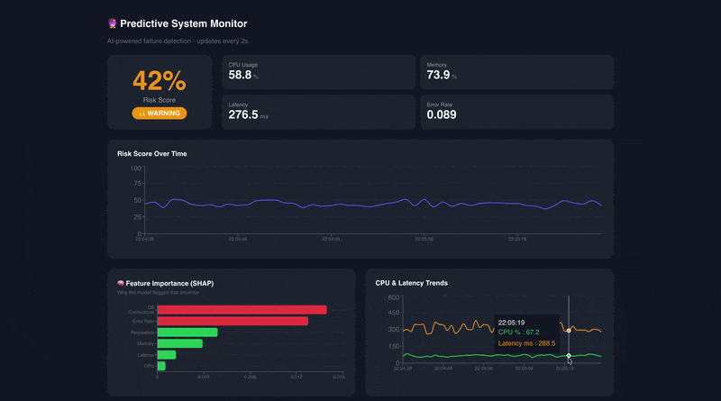

# 🔮 Predictive System Monitor

> AI-powered failure detection that predicts system issues **before** they happen.

Most monitoring tools tell you something broke. This one tells you **it's about to break**.

## What it does

- **Ingests** real-time system metrics via Apache Kafka
- **Detects** anomalies using Isolation Forest ML model
- **Explains** predictions with SHAP feature importance
- **Generates** AI-powered incident runbooks via Claude API
- **Visualizes** everything in a live React dashboard

## Tech Stack

| Layer | Technology |
|-------|-----------|
| Data Pipeline | Apache Kafka |
| ML Model | Isolation Forest + SHAP |
| Cache | Redis |
| Backend | FastAPI (Python) |
| Frontend | React + TypeScript + Recharts |
| AI | Anthropic Claude API |

## Quick Start
```bash
cp .env.example .env
# add your ANTHROPIC_API_KEY to .env
docker compose up
```

Open http://localhost:3000

## How the ML works

Isolation Forest detects anomalies by isolating observations through random splits. SHAP values explain which metrics contributed most to each prediction — making alerts actionable for on-call engineers.

## Demo


